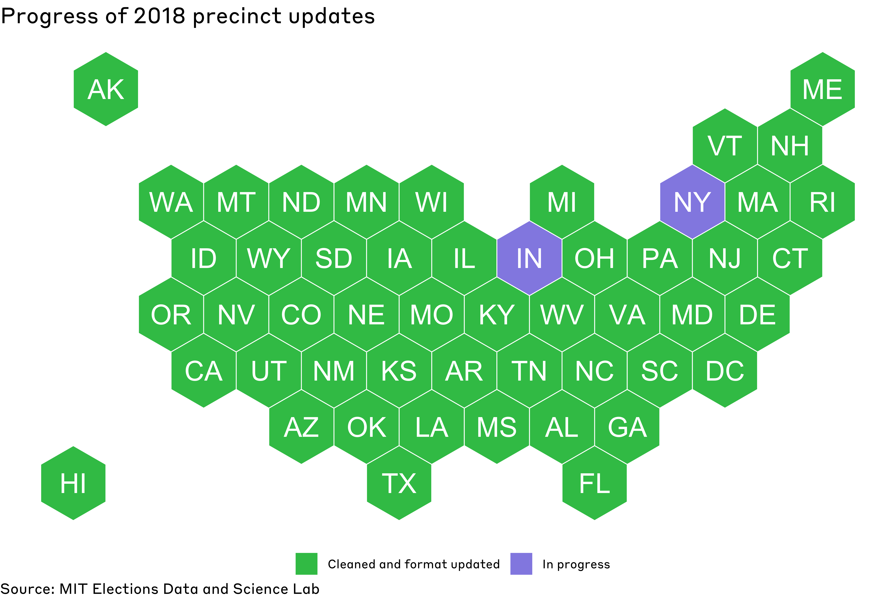

# 2018-elections-official

This is the MEDSL repository for official precinct returns for 2018 General Election.

 Users can download data by the level of office returns (president, US senate, US house, state, or local levels). For each state that is complete, users can also download all of the precinct-level returns separately in the individual_states folder above.

The returns are in progress, and will be updated periodically until completion. The following states and districts are included in the dataset:

## Alabama

Updated data added 03-07-2022.

* Small, marginal discrepancies are present between the raw aggregated precinct data from the state and the official reports. These discrepancies originate only from three counties: Chilton, Dallas, and Russell, and thus only affect offices with votes from those counties. Here are the county level discrepancies for the office of governor (official vs. our precinct data):
* Ivey
	- Chilton:	11291   vs 10487
	- Dallas:	4917	vs 4542
	- Russell:	7168	vs 7166

* Maddox
	- Chilton:	2501    vs 2347
	- Dallas:	10295	vs 9968
	- Russell:	7864	vs 7861

## Alaska

Updated data added 01-24-2022. Local data not included at the moment.

## Arizona

Updated data added 03-07-2022.

## Arkansas

Updated data added 01-24-2022. Local data not included at the moment.

## California

Updated data added 01-24-2022. Local data not included at the moment.

## Colorado

Updated data added 01-24-2022.

## Connecticut

Updated data added 02-18-2022.

## Delaware

Updated data added 01-24-2022.

## District of Columbia

Updated data added 01-24-2022.

## Florida

Updated data added 03-07-2022.

* Raw data acquired from: https://www.dos.myflorida.com/elections/data-statistics/elections-data/precinct-level-election-results/

* The precinct field is a combination of the 'Precinct Polling Location' and 'Unique Precinct Identifier', separated by an underscore "_"

* Results for Miami-Dade were sourced separately, directly from the Miami-Dade county (official results contained anomolous duplicates). The format of the precinct field is therefore different from the other counties. 
* Very small, marginal discrepancies were discovered when comparing aggregate precinct results to the certified county results in the following offices: ['GOVERNOR', 'US SENATE', 'COMMISSIONER OF AGRICULTURE']. 

## Georgia

Updated data added 01-24-2022. Local data not included at the moment.

## Hawaii

Updated data added 01-24-2022.

## Idaho

Updated data added 01-24-2022. Local data not included at the moment.

## Illinois

Updated data added 02-18-2022.

## Iowa

Updated data added 02-08-2022.

## Kansas

Updated data added 02-18-2022.

* Note that raw data reporting format leads to inclusion of precincts with 0 votes. Handle with care if computing aggregate statistics like average vote total by candidate.

## Kentucky

Updated data added 03-07-2022.

## Louisiana

Updated data added 01-24-2022.

## Maine

Updated data added 01-24-2022.

* Maine reports election results at the township level, rather at the precinct level. Township/municipality is treated as precinct in the cleaned data. 

* Certain rows contain county-fips info in place of jurisdiction-fips info for one of two reasons: (1) Maine reports state UOCAVA vote totals for each candidate aggregated at the county level. (2) Township information for certain towns could not be matched to our jurisdiction-fips merger file. 

## Maryland

Updated data added 02-18-2022.

## Massachusetts

Updated data added 01-24-2022. Local data not included at the moment.

## Michigan

Updated data added 02-08-2022.

* Precinct data are taken from https://miboecfr.nictusa.com/cgi-bin/cfr/precinct_srch.cgi?elect_year_type=2018GEN&county_code=00&Submit=Search

* Raw data includes rows with 0 votes even for locations where a race did not take place. For example, US House candidates will have the appropariate vote totals for precincts within the constituency and rows with 0 votes in precincts outside the constituency. Be sure to drop these rows if calcualting vote summary statistics like mean/median, othewise calculations will be biased.

* Precinct data contain precinct "9999", which are "statistical adjustments" rows that must be carefully considered when aggregating vote totals by office/county. Aggregating to state/county level including these 9999 precincts leads to the exact official SOS vote totals. 
* Vote totals aggregated by county that DO NOT include this 9999 precinct do not always match the official county totals for every race either. 
* All rows that have a discrepancy when aggregated by county (without the 9999 precinct rows) are marked readme_check == "TRUE". 
* More information about "9999" precincts and the nature of the discrepancies will be added to the README.md as we receive it.

## Minnesota

Updated data added 01-24-2022.

## Mississippi

Updated data added 01-24-2022.

## Missouri

Updated data added 01-24-2022. Local data not included at the moment.

## Montana

Updated data added 01-24-2022.

## Nebraska

Updated data added 01-24-2022. Local data not included at the moment.

## Nevada

Added 06-02-2021. Local data not included at the moment.

* From the official Nevada 2018 Election results spreadsheet: "Note: In cases where the cumulative turnout for a precinct for a race or ballot question is greater than 0 but less than 10, the numbers have been replaced with an asterisk in order to protect the secrecy of a voter's ballot, as required by Nevada Law. As a result, the total for a precinct may be different from what is reported on official documents." 
* We have included these cases in our cleaned results, replacing the asterisk with -1 to preserve the votes values as ints. These results should be dropped when aggregating results at the state/county level. Certain county aggregated results in affected races are marginally different from the official reported vote totals due to the masking of votes for privacy purposes.

## New Hampshire

Updated data added 02-08-2022.

## New Jersey

Updated data added 02-07-2022.

* Raw precinct data acquired from openelections (https://github.com/openelections/openelections-data-nj/tree/master/2018/counties). Marginal discrepancies identified in Essex, Hunterdon, and Salem counties when compared to official SOS aggregated results. Here are a list of discrepancies for US Senate candidate Robert Menendez (SOS vs our data):
- Essex: 		194,068 vs 193,796
- Hunterdon: 	24,823 vs 24,865
- Salem: 		9,060 vs 9,033

## New Mexico

Updated data added 01-24-2022. Local data not included at the moment.

* New Mexico "masks" vote totals in precinct results for candidates with small vote tallies, to protect the privacy of voters. These masked votes are denoted as "-1" in the votes column.

## North Carolina

Updated data added 03-07-2022.

## North Dakota

Updated data added 01-24-2022. Local data not included at the moment.

## Ohio

Updated data added 01-24-2022.

## Oklahoma

Updated data added 01-24-2022.

## Oregon

Updated data added 01-24-2022.

## Pennsylvania

Updated data added 02-08-2022.

* The raw precinct data is provided by the Pennsylvania Department of State.
* The precinct field is structured as:
	- ['precinct_code']_['cong_district']['senate_district']['house_district']_['vtd_code']
* The raw precinct data included a "Municipality Name" field, which has been stored in the "jurisdiction_name" field of our dataset. However, the "jurisdiction_fips" field is the same as the "county_fips" field, as there are no 10 digit jurisdiction FIPs codes associated with the provided municipalities. 
* There are marginal discrepancies between the aggregated precinct results and the results from the Secretary of State’s website. Precinct results are uncertified and uncorrected for later updates during the certification process, whereas the state website results reflect certified returns. Certified SOS results include “grace period” ballots (ballots postmarked and received by the Friday after election day), while the precinct results in many counties often do not. Counties with discrepancies are flagged readme_check = True.

* Here are the discrepancies by county for Governor (aggregated precinct data - official SOS results)
	- WESTMORELAND (WAGNER +287, WOLF +196)

## Rhode Island

Updated data added 02-07-2022.

## South Carolina

Updated data added 01-24-2022. Local data not included at the moment.

## South Dakota

Updated data added 01-24-2022. Local data not included at the moment.

## Tennessee

Updated data added 01-24-2022. Local data not included at the moment.

## Texas
Updated data added 02-07-2022.

* Raw data from Texas Legislative Council.

* precinct field is derived from taking 'CNTYVTD' and 'VTDKEY' and joining with the separator "_"

* 4 files failed to download, so the following results are excluded.
	- Dallas County J. P. Pct.3 Pl.1
	- Bexar County Court At Law No.12
	- Dallas County J. P. Pct.2 Pl.1
	- Harris County J. P. Pct.7 Pl.2

## Vermont

Updated data added 03-07-2022.

* Vermont provides the township level data broken down further by representative districts within township. The precinct field is thus a combination of the "Township" and "Rep District" fields, separated by an underscore "_".

* For State Senate races, Vermont has floating towns: towns that are physically located in one county but vote for senator in another county, so special care must be taken care off when aggregating votes.
	- Addison State Senate: Huntington is in Chittenden County and votes for Addison State Senator.
	- Bennington State Senate: Wilmington is in Windham County and votes for Bennington State Senator.
	- Caledonia State Senate: Bradford, Fairlee, West Fairlee, Newbury, Topsham are in Orange County and vote for Caledonia State Senator.
	- Essex-Orleans State Senate: Wolcott is in Lamoille County and votes for Essex-Orleans State Senator.
	- Franklin State Senate: Alburgh is in Grand Isle County and votes for Franklin State Senator.
	- Grand Isle State Senate: Colchester is in Chittenden County and votes for Grand Isle State Senator.
	- Windsor State Senate: Londonderry is in Windham County and votes for Windsor State Senator.

## Virginia

Updated data added 02-07-2022.

## Utah

Updated data added 02-07-2022.

* There are "supressed" votes in Weber county for certain small precincts to protect privacy. The county totals in Weber are therefore undercounted when compared to official county level results. The votes in these precincts are coded as -1, and should be dropped prior to any aggregation. 

* Other rows that are readme_checked == True are the result of PDF scraping errors. Major discrepancies with official results have been rectified, but some marginal discrepancies (off by no more than 5 votes with official results) remain. 

## Washington

Updated data added 01-24-2022. Raw precinct data acquired from the Secretary of State wesbite at times have marginal discrepancies when aggregated and compared to statewide official totals.

## West Virginia

Updated data added 01-24-2022.

## Wisconsin

Updated data added 01-24-2022. Local data not included at the moment.

## Wyoming

Updated data added 02-07-2022.

